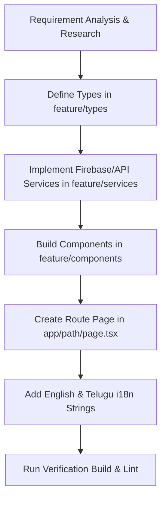

<!-- BEGIN:antigravity-framework-rules -->
# 🚀 Antigravity Agent Rules & Operating Principles

This file outlines the foundational rules, operational workflows, and architecture boundaries for **Antigravity AI Agent** working across workspace projects (including Next.js/Devalaya, Flutter/Hypermart, and related services).

---

## 🛡️ 1. Core Operating Principles

1. **Obey Explicit Directives:**
   - Always prioritize exact user instructions, architectural preferences, and design specifications without modification.
2. **Never Guess Implementation Details:**
   - Inspect authoritative source code, schemas, and types using search/view tools before writing or editing code.
3. **No Superficial Symptom Patches:**
   - Resolve root causes; never swallow errors, return dummy fallbacks silently, or comment out failing assertions.
4. **Empirical Log Verification:**
   - Read full un-truncated error tracebacks before forming diagnostic hypotheses.
   - Always run verification commands (`npm run build`, `flutter test`, `npm run lint`, etc.) before declaring success.

---

## 📅 Sprint Planning & Delivery Roadmap
- For full sprint schedules, user stories, definitions of done, and risk mitigations, consult [docs/SPRINT_PLANNING.md](file:///c:/Users/gurun/Documents/PROJECTS/hota-projects/temple/docs/SPRINT_PLANNING.md).

---

## 🏛️ 2. Devalaya Project Rules (Next.js & Firebase)

### Directory Architecture & Separation of Concerns
- `app/`: Next.js App Router ONLY (routes, layouts, error boundaries, API route handlers). **No heavy UI or business logic here.**
- `src/features/`: Feature-based modules (`auth/`, `calendar/`, `events/`, `panchangam/`, `admin/`, `gallery/`). Store feature-specific components, hooks, services, and types together.
- `src/components/`: Shared global UI components (`ui/`, `layout/`, `forms/`, `feedback/`).
- `src/lib/`, `src/providers/`, `src/config/`: Firebase configuration, global context providers, and environment setup.

### Design System & Visual Aesthetics
- **Theme Variables:** Use CSS custom properties from `docs/DESIGN_SYSTEM.md` (`var(--bg-base)`, `var(--color-primary)`, `var(--color-secondary)`, `var(--color-accent-gold)`, `var(--color-accent-emerald)`).
- **Themes:** Dual-theme support for `Prabha` (Light) and `Sandhya` (Dark) using `data-theme`.
- **Color Accent Limit:** Maximum 2 accent colors per view.
- **Typography:** Serif headings (`Cormorant Garamond` / `Ramabhadra`), Sans-serif body (`Inter` / `Noto Sans Telugu`), Tabular numbers (`JetBrains Mono`).
- **No Dense HTML Tables:** Render tabular data in responsive mobile-first cards.
- **Bilingual UI:** All user-facing components must support **English** and **Telugu** translation toggles.

---

## 🔄 3. Standard Development Workflows

### Workflow 1: Feature Development Cycle

1. **Planning Phase:** Check existing architectural patterns, KIs, and dependencies.
2. **Type Contracts:** Define TypeScript interfaces in `src/features/<feature>/types/`.
3. **Service Layer:** Build Firestore/Storage calls in `src/features/<feature>/services/`.
4. **UI Components:** Build modular UI components in `src/features/<feature>/components/`.
5. **App Router Integration:** Wire up page layout under `app/<route>/page.tsx`.
6. **Bilingual Verification:** Ensure both English and Telugu strings are connected.
7. **Empirical Build Verification:** Run build and lint checks to guarantee zero regressions.

---

### Workflow 2: Bug Fix & Debugging Protocol
1. **Log Extraction:** Obtain un-truncated error logs/stack traces.
2. **Root Cause Analysis:** Trace upstream data sources and call stacks using graph/search tools.
3. **Fix Implementation:** Apply targeted fixes adhering to component boundaries.
4. **Validation:** Execute unit tests or project build commands to verify complete resolution.

---

### Workflow 3: Admin & Protected Route Flow
1. Place all administrative pages strictly under `app/admin/`.
2. Wrap components with `ProtectedRoute` utilizing Firebase Auth state.
3. Use card-based list layouts optimized for mobile and desktop viewports.

<!-- END:antigravity-framework-rules -->
