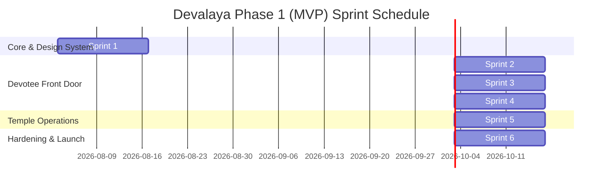

# 📅 Product Delivery Plan: Devalaya Temple Platform
**Document Version:** 1.0.0  
**Author:** Lead Software Project Manager  
**Project:** Devalaya (Next.js 16 + Firebase + Tailwind CSS + Framer Motion)  
**Target Architecture & Guidelines:** [.agents/AGENTS.md](file:///c:/Users/gurun/Documents/PROJECTS/hota-projects/temple/.agents/AGENTS.md)

---

## 🎯 Executive Summary & Delivery Strategy

As Lead Project Manager, I have structured the execution of **Devalaya Phase 1 (MVP)** into **6 two-week Sprints (12 weeks total)**. 

### Key Delivery Principles
1. **Vertical Slices:** Every sprint delivers testable, end-to-end features rather than horizontal layer-by-layer builds.
2. **Strict Adherence to Guidelines:** All code deliverables will follow the architectural standards set in [.agents/AGENTS.md](file:///c:/Users/gurun/Documents/PROJECTS/hota-projects/temple/.agents/AGENTS.md) (e.g., App Router isolation, component boundaries in `src/features/`, mobile-first cards instead of dense tables, and dual theme support).
3. **Empirical Quality Gates:** Every sprint finishes with automated build checks (`npm run build`), linting (`npm run lint`), and visual audits across **Prabha** (Light) and **Sandhya** (Dark) themes with bilingual verification (English/Telugu).

---

## 🚀 Sprint-by-Sprint Execution Roadmap

---

### 🟢 Sprint 1: Foundation, Design Tokens & i18n Core
**Goal:** Establish the scalable Next.js 16 setup, Firebase SDK integration, CSS custom properties, and bilingual provider.

- **User Stories & Tasks:**
  - **FE-101 (Setup):** Configure Next.js 16 App Router folder structure (`src/features/`, `src/components/`, `src/lib/`, `src/providers/`).
  - **FE-102 (Design Tokens):** Implement CSS custom properties for `Prabha` (Light) and `Sandhya` (Dark) themes in `src/app/globals.css`. Wire font families (`Cormorant Garamond`, `Ramabhadra`, `Inter`, `Noto Sans Telugu`, `JetBrains Mono`).
  - **FE-103 (Theme & i18n Context):** Build `ThemeProvider` and `LanguageProvider` with cookie persistence for English/Telugu toggling.
  - **FE-104 (Shared UI Components):** Build atomic design tokens in `src/components/ui/` (`Button`, `Card`, `Badge`, `Modal`, `AnnouncementBanner`).
  - **FE-105 (Navigation Layout):** Create responsive header, sticky collapsed nav (max 5 items), mobile slide-out drawer, and footer with gopuram SVG motif.
  - **BE-101 (Firebase Base):** Initialize Firebase Client SDK in `src/lib/firebase.ts` with Firestore & Auth connectors.

- **Definition of Done (DoD):**
  - Theme toggle switches seamlessly without layout shift or visual flashes.
  - Language toggle switches header/footer strings dynamically.
  - `npm run build` & `npm run lint` pass cleanly with zero warnings.

---

### 🟢 Sprint 2: Home Hub & Telugu Panchangam Engine
**Goal:** Deliver the primary devotee landing page with live Panchangam calculations and festival highlights.

- **User Stories & Tasks:**
  - **FE-201 (Panchangam Architecture):** Create `src/features/panchangam/` module (Types, Services, Components).
  - **FE-202 (Panchangam Grid UI):** Implement interactive monthly calendar grid with emerald festival tags (card-based, no HTML tables).
  - **FE-203 (Panchangam Detail Card):** Mobile-first expandable card showing Tithi, Nakshatra, Rahu Kalam, Sunrise/Sunset, and Tabular numerals (`JetBrains Mono`).
  - **FE-204 (Hero & Today at a Glance):** Build Hero section with parallax scroll, temple name, and live "Today at a Glance" widget on the homepage.
  - **BE-201 (Panchangam Sync Function):** Build Firebase Cloud Function / API route to sync or compute daily Panchangam data into Firestore `panchangam_days`.

- **Definition of Done (DoD):**
  - Panchangam calendar renders responsively on 360px mobile viewports without horizontal scrolling.
  - Festival days clearly stand out via Emerald accent tags.
  - Daily data fetches efficiently with ISR/caching.

---

### 🟢 Sprint 3: Events Showcase & WhatsApp Shareability
**Goal:** Build the complete Events showcase (Upcoming & Past) with ICS calendar export and auto-generated OpenGraph images.

- **User Stories & Tasks:**
  - **FE-301 (Events Module):** Build `src/features/events/` module (`EventCard`, `EventGrid`, `EventDetail`).
  - **FE-302 (Upcoming Events Feed):** Interactive card grid with date badges, event metadata, and "Add to Calendar" (.ics generation).
  - **FE-303 (Event Detail Page):** Dynamic App Router page `app/events/[id]/page.tsx` with rich description, timings, and map location.
  - **FE-304 (WhatsApp Shareability):** Integrate dynamic social sharing buttons with custom WhatsApp pre-filled text.
  - **BE-301 (OG Image Function):** Implement edge/Cloud Function to dynamically generate OpenGraph social preview images for shared event links.

- **Definition of Done (DoD):**
  - Devotees can click "Add to Calendar" and import events to Google/Apple Calendar.
  - Shared WhatsApp links display custom branded thumbnail images and titles.

---

### 🟢 Sprint 4: Media Gallery & Devotional Archive
**Goal:** Launch the high-performance past festival timeline archive and lightbox gallery.

- **User Stories & Tasks:**
  - **FE-401 (Gallery Module):** Build `src/features/gallery/` module (`GalleryGrid`, `LightboxModal`, `TimelineFilter`).
  - **FE-402 (Past Events Timeline):** Group past temple activities by year → festival with lazy-loaded media cards.
  - **FE-403 (Lightbox & Touch Viewer):** Build responsive image lightbox viewer supporting swipe gestures on mobile devices.
  - **FE-404 (Image Optimization):** Use `next/image` with WebP/AVIF variants, blur placeholders, and explicit aspect ratios.
  - **BE-401 (Firebase Storage Service):** Configure Firebase Cloud Function for automated image resizing (thumbnail + full-res display) upon admin upload.

- **Definition of Done (DoD):**
  - Lightbox opens smoothly on touch devices with swipe navigation.
  - Page achieves 90+ Lighthouse Performance score even with 20+ gallery items.

---

### 🟢 Sprint 5: Firebase Admin CMS & Staff Portal
**Goal:** Deliver a protected, simple admin dashboard so temple staff can manage events, announcements, and galleries in < 5 minutes.

- **User Stories & Tasks:**
  - **FE-501 (Admin Protection):** Build `src/features/auth/` module (`ProtectedRoute` component, Firebase Auth login page under `app/admin/login/page.tsx`).
  - **FE-502 (Admin Dashboard Layout):** Mobile-first admin layout under `app/admin/` with quick action buttons.
  - **FE-503 (Event Manager CMS Form):** Simple form to create/edit upcoming events and publish past event summaries.
  - **FE-504 (Gallery Uploader):** Drag-and-drop media uploader connected to Firebase Storage.
  - **FE-505 (Announcement Strip Control):** Form to publish/dismiss urgent top-bar notices (e.g., Maintenance / Special Darshan hours).

- **Definition of Done (DoD):**
  - Temple staff can log in, upload 3 photos, add an event title in Telugu/English, and publish in under 3 minutes.
  - Unauthenticated users attempting to visit `/admin` routes are cleanly redirected to login.

---

### 🟢 Sprint 6: Quality Assurance, Accessibility & Launch
**Goal:** Execute end-to-end performance optimization, WCAG AA accessibility audit, and production deployment.

- **User Stories & Tasks:**
  - **QA-601 (Performance Optimization):** Optimize font loading, image caching, and ISR intervals. Verify homepage load under 2s on 4G network.
  - **QA-602 (Accessibility Audit):** Verify WCAG AA contrast ratio compliance across both `Prabha` and `Sandhya` themes using automated & manual tools.
  - **QA-603 (Bilingual Proofing):** Verify 100% string coverage for English and Telugu across all user-facing features.
  - **QA-604 (SEO & Structured Data):** Inject `schema.org` (`Event`, `Place`, `CivicStructure`) JSON-LD scripts into dynamic pages. Generate `sitemap.xml` and `robots.txt`.
  - **OPS-601 (Production Deployment):** Deploy Next.js App Router to Vercel/Firebase Hosting with production Firestore security rules.

- **Definition of Done (DoD):**
  - Lighthouse Score on Mobile: **90+ Performance, 95+ Accessibility, 100+ SEO**.
  - 0 console errors or TypeScript compilation issues during `npm run build`.
  - Signed off by Temple Committee and ready for public launch.

---

## 📊 Risk Management & Mitigation Matrix

| Risk Factor | Severity | Mitigation Strategy | Owner |
|---|---|---|---|
| **Panchangam Data Accuracy** | High | Priest / SME sign-off step included in Sprint 2; manual override field added in Admin CMS. | Product Owner / SME |
| **Saffron/Gold Contrast Failure** | Medium | Use darker kesari (`--color-primary-hover`) for text on light backgrounds; validate via automated contrast checker. | Full-stack Dev |
| **High Photo Upload Sizes** | Medium | Automated Firebase Cloud Function thumbnail generation in Sprint 4; client-side pre-compression. | Full-stack Dev |
| **Elderly Usability Barriers** | Low | High contrast toggle, min 44px tap targets, large typography mode added in Sprint 1. | Full-stack Dev |

---

## 🛠️ Verification & Sign-off Protocol
Before closing any Sprint task:
1. Run `npm run build` to ensure zero compilation or App Router errors.
2. Run `npm run lint` to enforce formatting and import standards.
3. Test layout across **Prabha** and **Sandhya** themes on a simulated mobile device (360px viewport).
